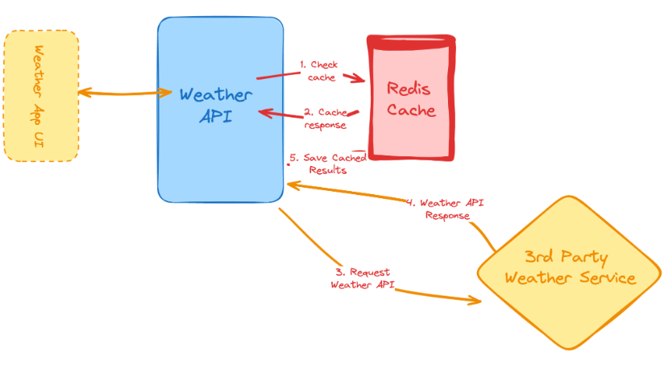

# Weather API Wrapper Service

A Node.js & Express backend service that wraps around the **[Visual Crossing Weather API](https://www.visualcrossing.com/weather-api)** and adds caching with Redis.  
This prevents repeated external API calls, improves response times, and hides sensitive API keys from clients.

> This project is in early development